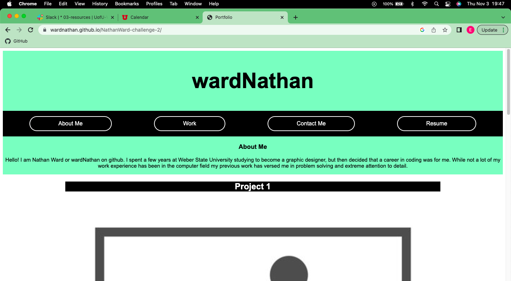

# portfolio-challenge-2

## Description

This website was created to be placeholder design for a portfolio once I make some projects to display for future inquirers. 

## Installation

N/A

## Usage

The Navigation bar will take you to different sections of the page when selected. If you select one of the project photos it will take you to a placeholder website that will soon hold the project created. The contact me buttons are also links to ways to get a hold of me.

## Credits

N/A

## License

MIT License

## Link and Screenshot

https://wardnathan.github.io/NathanWard-challenge-2/

